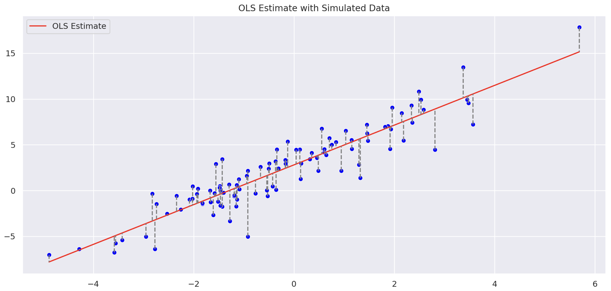

This is my attempt at creating a reference post for linear regression. It starts with a brief introduction of the regression problem and then jumps into to estimation, where different ways of deriving the regression estimators are discussed. The assumptions of the OLS regression model are then presented and individually tinkered with to get a better intuition around them. Finally, a variety of additonal connections and proofs are presented regarding different aspects of the regression model. This isn't meant to be an introductory post on linear regression, but rather a refresher for grad students / professionals.

## Linear Regression

The linear regression model models the conditional expectation of $\mathbb{E}(Y \mid X)$ with a linear function:

$$
f(X; \beta) = \beta_0 + \sum_{j=1}^P x_j \beta_j
$$

There are many ways of estimating $\beta$, each with their tradeoffs. However, by far the most widely used is OLS estimation. This provides a simple framework that can be analyzed from both a statistical and mathematical perspective. From a statistical point of view, OLS estimates allow for rigorous statistical analysis of models through distributional assumptions on the estimated parameters. From a mathematical point of view, OLS estimates can be derived and analyzed using only linear algebra concepts.

## Ordinary Least Squares Regression

The standard OLS model finds the parameters of a "best fitting" line of the form
$f(X) = \sum_{i=0}^p X_i \beta_i$ by minimizing the vertical distance between each point and that line. This is found by minimizing the following equation:

$$
\begin{align*}
S(\beta) &= \sum_{i=1}^N (X_i\beta - y_i)^2 \\
\end{align*}
$$

A visual representation of this is shown in the figure below. Note that OLS does **not** minimize the distance between each point and the OLS estimate, since this would mean minimizing the length of perpenticular lines connecting each point to the OLS estiamte. Instead, the OLS objective minimizes the distance along the y-axis.

> From a statistical point of view, this criterion is reasonable if the training observations $(x_i, y_i)$ are drawn independently from their poplulation, or if the $x_i$'s are not independent, but conditionally independent given $y_i$.

I don't quite understand the statement above, which was taken from Elements of Statistical Learning. My intuition is that the latter case happens often in autoregressive models.

    
    

        
 OLS estimate with simulated data. The OLS loss function minimizes the vertical distance (L2 distance) 

    

### Estimation

Minimizing $S(\beta)$ above is the same as maximizing the likelihood function under the assumption of Gaussian error (I discuss this more in my [Gaussian Noise and Mean Squared Error](https://jramkiss.github.io/2022/01/05/MLE-loss-regression/) post). Using matrix notation, we can re-write $S(\beta)$ to be:

$$
\begin{align*}
S(\beta) &= (y - X\beta)^T (y - X\beta) \\
\end{align*}
$$

This is a quadratic in terms of $\beta$, so differentiating twice gives us:

$$
\begin{align*}
\frac{\partial S}{\partial \beta} = -2X^T(y - X\beta) \\
\frac{\partial^2 S}{\partial \beta \partial \beta^T} = 2X^TX
\end{align*}
$$

Assuming that $X$ has **full-rank** (i.e. all columns of $X$ are linearly independent, for $X \in \mathbb{R}^{p \times N}, p \lt N$) and therefor $X^TX$ is positive definite, we set the first derivative to zero: $X^T(y - X\beta) = 0$, resulting in the unique solution:

$$
\hat{\beta} = (X^TX)^{-1}X^T y
$$

#### Geometric Interpretation

Another way to interpret the estimation problem is through the lens of projections. The features (or design matrix as statisticians will call it), $X$, span a subspace of $\mathbb{R}^P$, called the column space of $X$. We minimize $S(\beta)$ by choosing $\hat{\beta}$ such that the residual vector, $y - \hat{y}$ is orthogonal to the column space of $X$. This is represented mathematically by $X^T(y - X\beta) = 0$.

TODO: add plots and expand:
- Orthogonality between X and $\epsilon$
- $Cov(y, \epsilon)$
- Decomposition of $y$ into 2 orthogonal components: X and residual
- $Cov(\hat{\epsilon}, \hat{y})$: Is there a relationship between the residuals and the fitted values
- $Cov(\hat{\epsilon}, y)$: Is there a relationship between the residuals and targets?
- Why do we plot residuals VS fitted values when diagnosing regressions?

### Assumptions of OLS

Up until now, we have only made one soft assumption for the linear regression model, which is that the conditional expectation, $\mathbb{E}(Y \mid X)$, can be reasonably approximated with a linear function. As I mentioned in the intro, we can view the OLS estimates through different lenses. Through the eyes of a statistician, the first question that arises is: what is the distribution of my estimator? To answer this question, we need a few more assumptions. Firstly, assume that the deviation of $y$ around its conditional expectation, $\mathbb{E}(Y \mid X)$, is Gaussian. It turns out that deriving the OLS estimates in the manner above, or by specifying the resulting likelihood function from this distributional assumption yields the same result. Finally, we also assume that the observations, $y_i$ are uncorrelated and have constant variance.

$$
\begin{align*}
y &= X\beta + \epsilon \\
\epsilon &\sim \mathcal{N}(0, \sigma^2) \\
y &\sim \mathcal{N}(X\beta, \sigma^2)
\end{align*}
$$

Therefore, the distribution of $\hat{\beta}$ is:

$$
\begin{align*}
\hat{\beta} &\sim \mathcal{N}(\beta, (X^TX)^{-1}X \text{Var} (y)((X^TX)^{-1}X^T)^T) \\
\hat{\beta} &\sim \mathcal{N}(\beta, (X^TX)^{-1} \sigma^2)
\end{align*}
$$

This distribution will be useful when analyzing the impact of model assumptions later on!

#### 1. Multicollinearity in Features

- impact on estimates
- impact on invertability of matrix
- impact on distribution of parameters

In practice, it is unlikely that all columns of $X$ are linearly independent, which means that $X$ is not full-rank and $(X^T X)$ is a singlular matrix which does not have a unique inverse. In these cases, the resulting solution will still be a projection of $y$ onto the column space of $X$, however there will be more than one way to epxress this projection. This makes interpretation of the individual $\beta$'s unreliable.

Multicollinearity also affects the variance of the estimators. The variance of coefficient $j$ can be expressed in terms of $R^2_j$, the coefficient of determination for estimator $j$ as:

$$
\begin{align*}
\text{Var}(\beta_j \mid X) &= \frac{1}{1 - R^2_j} \frac{\hat{\sigma}^2}{\sum_{i=1}^n (x_{ij} - \bar{x}_j)^2}
\end{align*}
$$

Proof of $Var(\beta_j)$: [here](https://en.wikipedia.org/wiki/Variance_inflation_factor#cite_note-3). Here, $R^2_j$ is the $R^2$ obtained from the regression of $x_j$ onto $x_{1:j-1, j+1:p}$, which measures how related $x_j$ is to the other covariates. We can clearly see that as $R^2_j$ approaches $1$, the variance of coefficient $j$ explodes. To show why this is dangerous in real life, we can think of a contrived example with $p >> 2$ covariates, where $x_1 = \alpha x_2, \alpha \in \mathbb{R}$. Without knowing the relationship between $x_1$ and $x_2$ before hand and fitting a regression, the variance of both $\hat{\beta}_1$ and $\hat{\beta}_2$ will be extremely large, due to large $R^2_1$ and $R^2_2$. In practice, penalization terms can be added to the loss function in order to curb this problem.

#### 2. Linear Relationship Between $X$ and $Y$

A core assumption of the model is that the relationship between $Y$ and $X$ can be reasonable approximated linearly. What makes this model so universal is that the variables, $X$, can be arbitrary transforms or combinations of other features, so non-linear relationships between $X$ and $y$ can still be modelling under this framework.

- Impact of breaking this assumption

#### Exogeneity

This is an assumption about the relationship between the errors and the features. Specifically it states that $\mathbb{E}(\epsilon \mid X) = 0$, which implies that $\epsilon$ is uncorrelated with $X$ (uncorrelation does not imply independence).

#### Homoskedasticity

Assumption of constant variance in response variable, which shows up in the residuals after fitting a model. This is an assumption that the residuals are uncorrelated across observations and have the same variance.

## Model Diagnostics

In this section I present a few standard goodness-of-fit checks, why they are important, and how we can interpret them.

#### 1. Histogram/QQ-plot of Residuals

This is probably the most straightforward diagnostic test in terms of its interpretation from the model. Recall that in our regression model we made the assumption that $\epsilon \sim N(0, \sigma^2)$. Now that the model is fit and we have an estimate of $\epsilon$, $\hat{\epsilon}$, we can verify this distributional assumption with a QQ-plot or a histogram. QQ-plots will be more telling, especially in the tails, which can give us an idication of how appropriate our error distribution is. For example, we may want to use a t-distribution if $\hat{\epsilon}$ has heavy tails.

#### 2. Plot of Residual VS Fitted Values

This is an interesting plot, because it was not immediately obvious to me why we needed it. This is a plot of the fitted values on the x-axis and the residuals on the y-axis and is mainly used as a visual check of heteroskedasticity. There should be no relationship in the variance of

## Univariate Linear Regressions

As simple as they seem on the surface, univariate linear regressions are the building block of statistical analyses, which makes the understanding of them imperative.

### FAQ

Questions to answer:

- Is there a relationship between the p-value and $R^2$ in simple linear regression?
- What happens when each of these assumptions are broke. With proofs, code and explanations
- What happens to regression estimates when the features have high multicollinearity? Proof
- What happens to the $R^2$ when we add another covariate to our regression?
- What does the condition number tell us and how can we use it?
- Multicollinearity affects the inversion of the feature matrix. If the determinant is very close to 0, the determinant of the inverted matrix will become extremely large. This will multiply the noise in the data. How does this work?
- A stock's $\beta$ is calculated by regressing its returns onto the S&P 500 returns. What is the change in interepretation when we flip this regression and why is it like this?
- Eigenvalues are not uniquely determined. How does this affect linear regression and PCA?
- What are the differences between linear regression and the weights of the first principal component?
- What variables are correlated with the error terms?

## References

- [Linear Regression Notes - IIT](https://cran.r-project.org/doc/contrib/Faraway-PRA.pdf)
- [Linear Regression Primer - MIT OCW](https://safe.menlosecurity.com/https://ocw.mit.edu/courses/18-s096-topics-in-mathematics-with-applications-in-finance-fall-2013/resources/mit18_s096f13_lecnote6/)