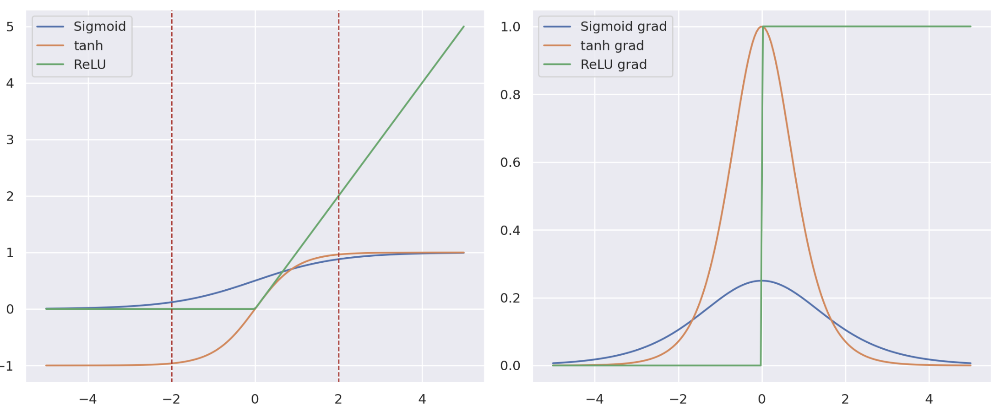

This is a collection of FAQ's and learnings from my experiences training deep learning models.

## FAQ

**Question**: I am using log-loss (cross entropy loss) to train a classification model with $k$ classes. If initialization of the network is completely random, what is the ballpark initial loss I can expect from the network? i.e. if we run 1 example through the initialized model and calculate the loss, what value should we expect? 

**Answer**: If the initialization of the network is completely random, we expect the output of the network to be random. This would mean a uniform distribution across the $k$ classes. Since log-loss is equal to the negative log-likelihood: 

$$
\mathcal l(\Theta; X, y) = - \sum_{i=1}^{N} \log p(y_i \mid X_i)
$$

with random initialization, $p(y_i | X_i) = \frac{1}{k}$. So we expect $-\log (\frac{1}{k})$ if the network is initialized completely randomly.


**Question**: Can I just train my model for longer and expect better performance?

**Answer**: This largely depends on the context and difficulty of the problem. In the context of language models, this question comes up quite often. Many of these models are trained using a learning rate scheduler, which requires a pre-defined number of iterations to determine the LR at each step. Naively increasing this number won't result in improved performance because at some point the learning rate will become too low. In addition, we can't know how many iterations is too much before hand. Checkpointing the model throughout training while using an LR scheduler is also not enough to adequately compare performance since the learning rate was not allowed to "cooldowm". This [Twitter thread](https://twitter.com/sytelus/status/1688119658266890240), and [section 3.5 of this paper](https://arxiv.org/pdf/2106.04560.pdf) describe a way to checkout models using LR schedulers. Essentially, a target number of iterations is set, then a model checkpoint is saved. At this point, the learning rate is annealed to 0 using another scheduler. 

**Question**: Should I normalize sentence embeddings?

**Answer**: It depends on the downstream task. When we normalize a vector we remove the impact of length, which is fine in some similarity tasks, which [this answer](https://stats.stackexchange.com/questions/177905/should-i-normalize-word2vecs-word-vectors-before-using-them) explains. However, the length of the word embeddings may carry important information as well. 


**Question**: Why are activation functions needed and why would you not use the identity function?

**Answer**: Activation functions allow neural networks to learn non-linear relationships in data. Using an identity function will not introduce any non-linearity into the model.

**Question**: What problems arise when using tanh and sigmoid activation functions? 

**Answer (INCOMPLETE)**: The answer to this question lies in the gradient of these functions and the backpropagation algorithm: 

First recall how gradients flow through a neural network. For an activation function, $\sigma(x)$, weight matrices, $W_1, W_2, W_3$, a simple 2-layer NN is as follows:  

$$ \hat{y} = W_3 \sigma(W_2\sigma(W_1X)) $$

By the chain rule, if we have a function that is defined as a composition of 2 functions, such as $f(x) = h(g(x))$, then its derivative is $f'(x) = h'(g(x))*g'(x)$. The backpropagation algorithm uses this to calculate the gradient of $W_1, W_2, W_3$ w.r.t. some loss, $L(\hat{y},y)$ as follows: 

$$
\begin{align}
\frac{\mathrm{d} L(\hat{y}, y)}{\mathrm{d} W_1} &= \frac{\mathrm{d} \hat{y}}{\mathrm{d} W_1} \frac{\mathrm{d} L(\hat{y}, y)}{\mathrm{d} \hat{y}} \\
&= \frac{\mathrm{d} Q_1}{\mathrm{d} W_1} \frac{\mathrm{d} \hat{y}}{\mathrm{d} Q} \frac{\mathrm{d} L(\hat{y}, y)}{\mathrm{d} \hat{y}}

\\
\frac{\mathrm{d} L(\hat{y}, y)}{\mathrm{d} W_2} = 
\end{align}
$$

```python
import matplotlib.pyplot as plt
import seaborn as sns; sns.set()
%matplotlib inline
%config InlineBackend.figure_format = 'retina'

import numpy as np 
from scipy.special import expit

x_vals = np.linspace(-5, 5, num=200)

relu = lambda x: np.maximum(0, x)
relu_grad = lambda x: list(map(lambda z: 0 if z <= 0 else 1, x))
sigmoid_grad = lambda y: y * (1-y)
tanh_grad = lambda y: 1 - y**2

y_sigmoid = expit(x_vals)
y_sigmoid_grad = sigmoid_grad(y_sigmoid)
y_relu = relu(x_vals)

y_tanh = np.tanh(x_vals)
y_tanh_grad = tanh_grad(y_tanh)
y_relu_grad = relu_grad(y_relu)

fig, ax = plt.subplots(ncols = 2, figsize=(12, 5), sharex=True)

ax[0].plot(x_vals, y_sigmoid, label="Sigmoid")
ax[0].plot(x_vals, y_tanh, label="tanh")
ax[0].plot(x_vals, y_relu, label="ReLU")
ax[0].axvline(x=-2, linestyle = '--', lw=1, color="firebrick")
ax[0].axvline(x=2, linestyle = '--', lw=1, color="firebrick")
ax[0].legend()

ax[1].plot(x_vals, y_sigmoid_grad, label="Sigmoid grad")
ax[1].plot(x_vals, y_tanh_grad, label="tanh grad")
ax[1].plot(x_vals, y_relu_grad, label="ReLU grad")
ax[1].legend()
plt.tight_layout();
```

<div class='figure' align="center">
    
    <div class='caption'  width="50%" height="50%">
        <p>  </p>
    </div>
</div>

$$
\tanh(x) = \frac{e^x - e^{-x}}{e^x + e^{-x}} \\
\frac{\mathrm{d}}{\mathrm{d}x} \tanh(x) = 1 - \tanh(x)^2  \\
$$

The logistic sigmoid function on the other hand, ranges in values from $(0, 1)$. 

$$
\text{sigmoid}(x) = \frac{1}{1 + e^{-x}} \\
\frac{\mathrm{d}}{\mathrm{d}x} \text{sigmoid}(x) = \text{sigmoid}(x)(1 - \text{sigmoid}(x))
$$

Both of these activation functions saturate when the absolute value of the input is too large. The main problem with this saturation is that the gradients will be 0 and they will update less frequently during training. 


**Question**: How does ReLU activation functions help solve issues with sigmoid and tanh activations and what new problems do ReLU present?

**Answer**: 

**Question**: Why do neurons tend to die when using ReLU activations with a high learning rate?

**Answer**:

**Question:** In a multi-task model with hard parameter sharing, what is the difference between parsing multiple different inputs as opposed to the same input with multiple labels?

**Answer:** 

## General Knowledge Questions

**Question**: What is layer and batch normalization and how do they help avoid vanishing and exploding gradients?

**Question**: How does batch normalization affect the convergence of deep networks?

**Question**: Why is initialization of neural networks important? 

**Question**: How do residual connections in ResNets help in training deeper models?

**Question**: What are the advantages of using the attention mechanism in sequence models? What problem with recurrent architectures does the attention mechanism solve?

**Question**: How do vanishing and exploding gradients arise in neural networks? How do they affect training performance and how can they be mitigated?

**Question**: What are the trade-offs between bi-directional and uni-directional RNN's?

**Question**: Why might one choose max-pooling over average pooling in a convolutional neural network? 

**Question**: How does the choice of optimizer impact model convergence and final performance?

**Question**: Why might my models's loss suddenly spike or become NaN during training? 

**Question**: How do learning rate schedules like cosine annealing or learning rate warmup affect training dynamics?

**Question**: What are some effective strategies for parallelizing and distributing deep learning model training across multiple GPU's or nodes? 

**Question**: 