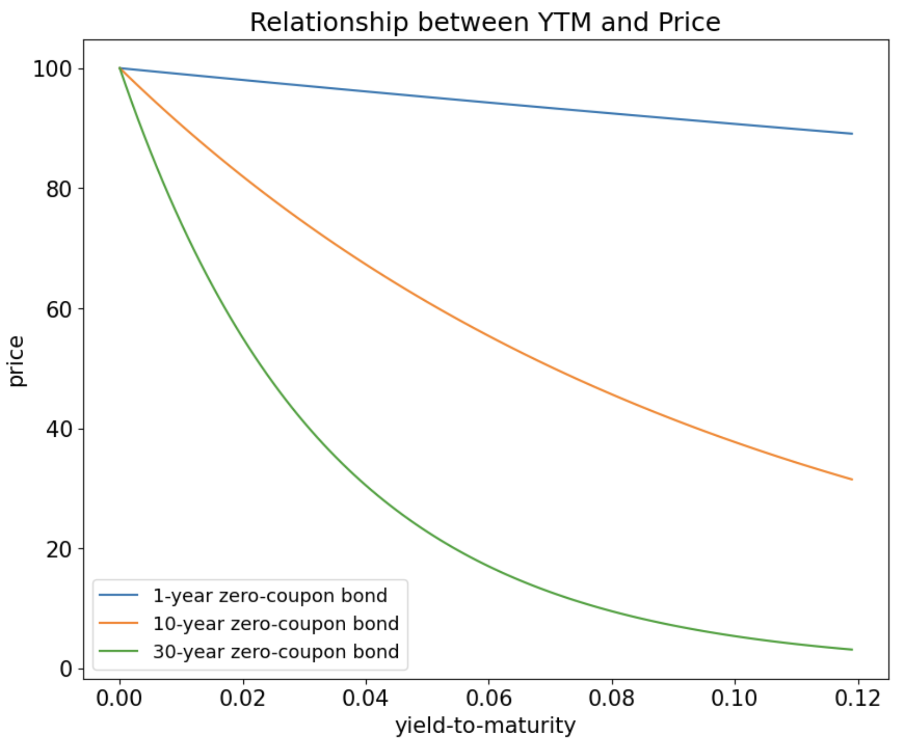
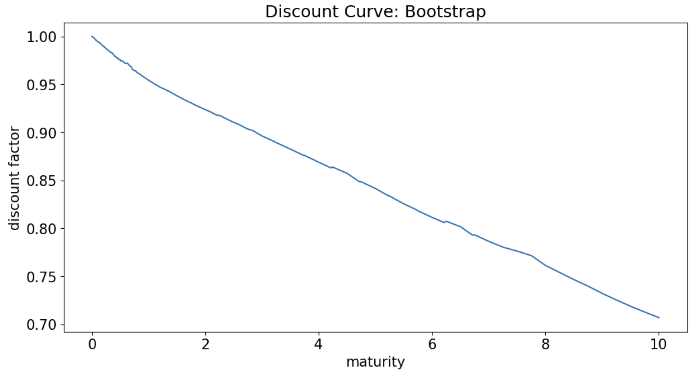
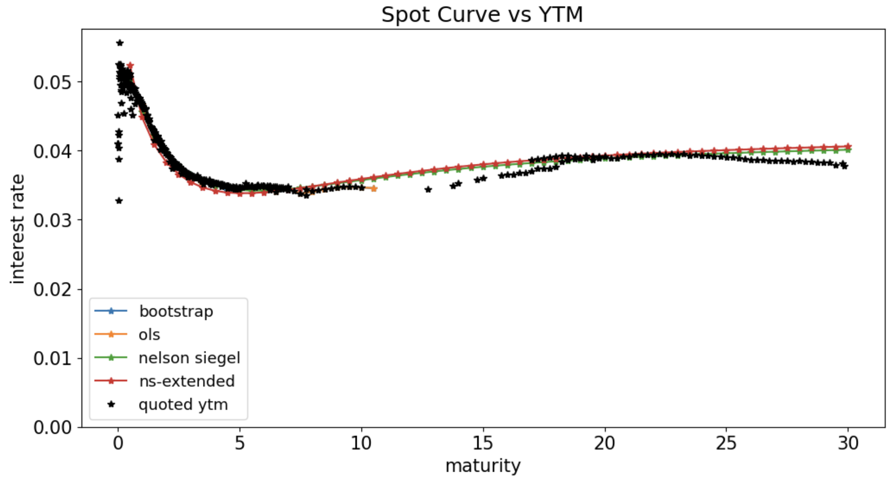
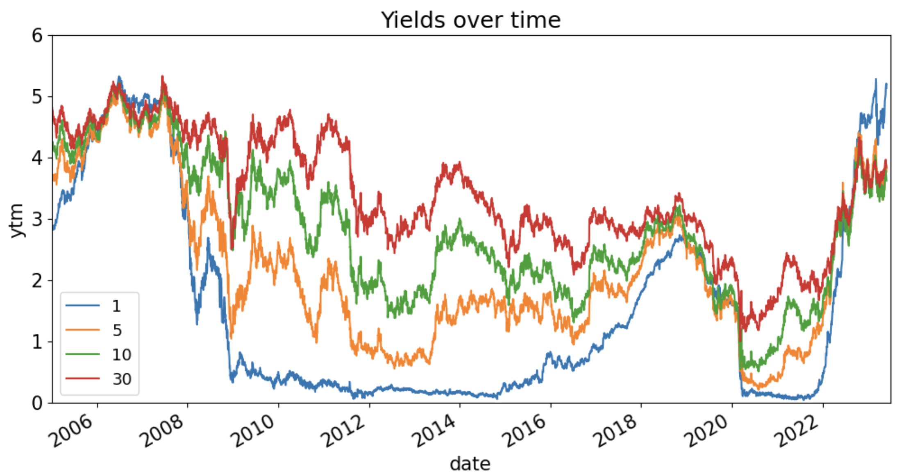
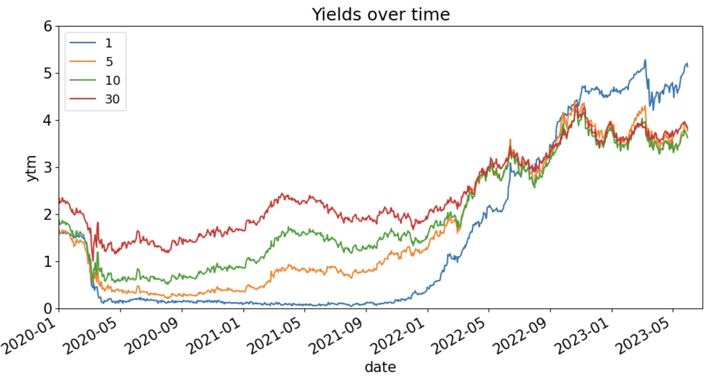
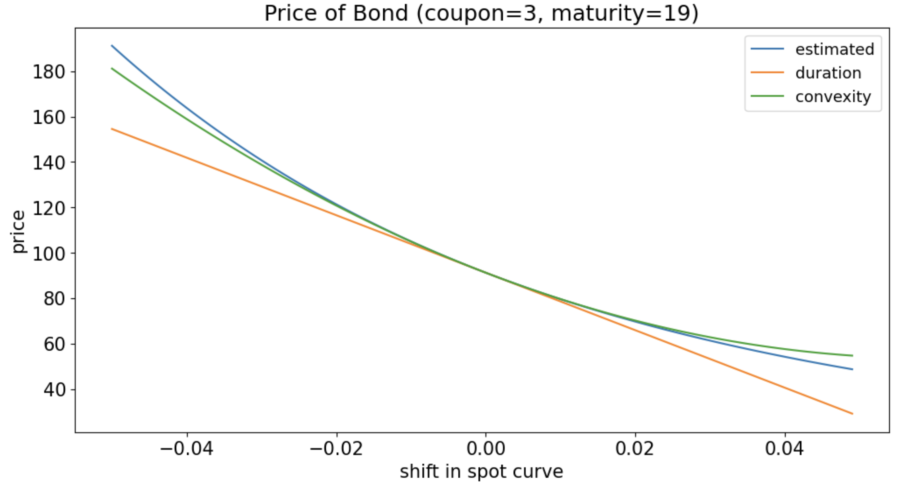
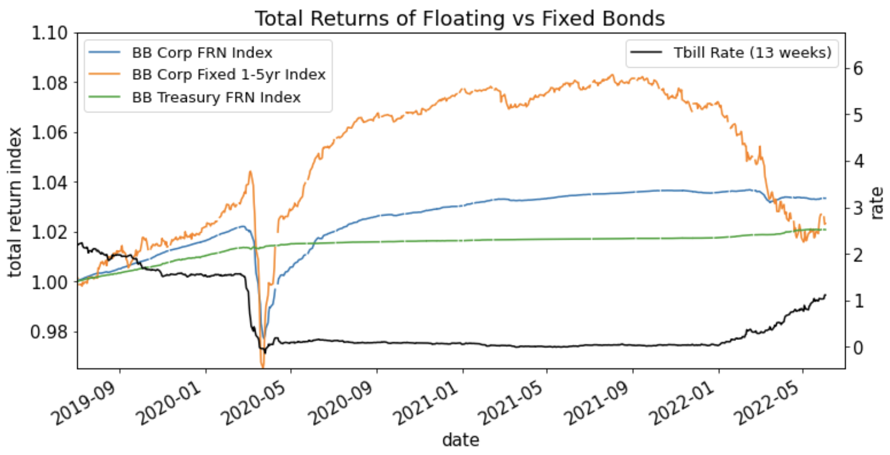

# Fixed Income

## Treasury Debt Instruments

These are US debt instruments issued by the US Treasury that pay a semi-annual coupons at specified rate, followed by the final coupon payment and the principal payment at the maturity.

|         | Maturity            | Coupon   | Coupon Frequency | Principal          |
|---------|---------------------|----------|------------------|--------------------|
| T-bills | 4, 8, 13, 26, 52 weeks | None     | None             | Fixed              |
| T-notes | 2, 5, 7, 10 years      | Fixed    | Semiannual       | Fixed              |
| T-bonds | 20, 30 years            | Fixed    | Semiannual       | Fixed              |
| TIPS    | 5, 10, 30 years     | Fixed    | Semiannual       | Inflation adjusted |
| FRNs    | 2 years             | Floating | Quarterly        | Fixed              |
| STRIPS  | Derived             | None     | None             | Fixed              |

Reference: Mark Hendricks' notes and https://www.treasurydirect.gov/indiv/research/indepth/tbills/res_tbill.htm
 

The traditional debt instruments are T-bills, notes and bonds: 
- T-bills: $\le 1$ year maturity with no coupon (zero-coupon bonds)
- T-notes: 1, 5, 7, 10 year maturity with semi-annual coupon
- T-bonds: 20, 30 year maturity with semi-annual coupon

The US Treasury also issues Treasury Inflation Protected Securities (TIPS) for longer than 1 year maturity, which provide a hedge against inflation for investors. The coupon rate for a TIPS issue is fixed, but the face-value of the bond changes with CPI inflation. The fixed coupon rate is multiplied by an inflation-adjusted face-value, which leads to an inflation adjusted coupon. 

- Floating rate notes and STRIPS are also issued. FRN's have a floating coupon rate that provides a hedge against changing interest rates, while STRIPS are created by "stripping" the coupon and principal payments of an issue to create multiple zero-coupon bonds. This allows investors to trade zero-coupon bonds with maturities greater than 1 year. 

### Pricing Treasury Issues

Price is quoted per $100 face value. A bond trading above face-value is said to be trading above par. Bonds with a larger coupon rate than the current interest rate trade above par. As current interest rate increases, a bond with coupon rate, $c$, will become less attractive to investors, driving down the price. On the other hand, as interest rates decrease, this bond will become more attractive. 

The only factors impacting the price of a new issue is the time to maturity, $T$ and the coupon rate, $c$. In a frictionless market, the time to maturity would be irrelevant to the price. A fresh 5-year note would have the same price as a 10-year note issued 5 years ago with the same coupon. However, because of frictionality and liquidity issues, on-the-run bonds (i.e. freshly issued) tend to have higher liquidity and thus a higher price. 

### Discount Yield

The discount yield is important for quoting money-market prices but is not popular for pricing and research. **Treasury bills** are typically quoted as discount yields. For a price of $P$, face value of $\$100$ and no coupon, the discount yield is:

$$\text{discount yield} = \left(\frac{360}{n}\right)\frac{100-P}{100}$$

### Day-Count Conventions

The accrued interest is computed with a day-count convention

$$\text{accrued interest} = \frac{\text{days counted}}{\text{days in reference period}} \times \text{interest in reference period}$$

Common day-count conventions include:
* actual/actual: treasury notes and bonds
* 30/360: corporate and municipal bonds
* actual/360: money-market instruments (issued with 1yr or less, little credit risk)

Careful, or can lead to seeming arbitrage that doesn't exist.
* Hull's Business Snapshot 6.1 mentions case of T-bond vs Corp and former getting 1 day of accrual Feb 28 to Mar 1, while latter gets 3 days of accrual.

## Yied Curves and Discount Rates 

The yield-to-maturity (YTM) on a bond is merely a different way of quoting it's current market price. We can either talk about a bond's value as changes in price or changes in yields. It represents the average rate of return "received" if an investor were to purchase the bond at the quoted price and hold until maturity. For a bond, $j$, with maturity date, $T$, coupon rate, $c$, and coupon payments at times $t_i, 1 \le i \lt n$, we define the price function $P_j(t,T,c)$ as a function of the YTM, $y_j$:

$$
\begin{align*}
P_j(t,T,c) = \sum_{i=1}^{n-1}\frac{100\left(\frac{c}{2}\right)}{\left(1+\frac{y_j}{2}\right)^{2(T_i-t)}} + \frac{100\left(1+\frac{c}{2}\right)}{\left(1+\frac{y_j}{2}\right)^{2(T-t)}}
\end{align*}
$$

Where $t$ is the current/observed timepoint and $T-t$ is measured in years. Note that the same rate, $y_j$, is discounting cashflows at different maturities. **This makes the YTM (and price) unique to the coupon rate and term structure of security, $j$.**

**YTM has a non-linear and inverse relationship with bond price**. This can be seen from the formular above, but is easier to see on a zero-coupon bond: 

$$
\begin{align*}
P_j(t,T,0) = \frac{100}{\left(1+\frac{y_j}{2}\right)^{2(T-t)}}
\end{align*}
$$

<!--  -->

    
    

        
 

    

For a coupon bond, YTM is not the return. This is becasue the forumla for YTM assumes we can re-invest the coupon payments at the YTM, which is not guaranteed. 

### The Spot Curve and No Arbitrage

Given a bond with scheduled coupon payments, we are able to calculated it's YTM for the current market price. However, as we have seen, this cannot be used to compare bonds with different coupon rates and payment structure. In addition, the YTM for a bond is an **average** discount rate applied to each cash flow. Consider 2 bonds with the same coupon rate, however one has 5 years to maturity and the other has 10. There is no difference in the first 4.5 years of cash flows received from these bonds, however because they have different maturities, their YTM will be different. Based on no-arbitrage pricing, the cost of these cash flows (cost can also be seen as discount rate) should be the same. We seek a rate which can be used across bond maturities to discount future cash flows. This is the spot rate. 

We seek a **spot curve** of discount rates, $r(t,T)$ such that we can price cashflows using:

$$
\begin{align*}
P_j(t,T,c) = \sum_{i=1}^{n-1}\frac{100\left(\frac{c}{2}\right)}{\left(1+\frac{r(t,T_i)}{2}\right)^{2(T_i-t)}} + \frac{100\left(1+\frac{c}{2}\right)}{\left(1+\frac{r(t,T)}{2}\right)^{2(T-t)}}
\end{align*}
$$

This differs from the YTM calculation since the spot rate, $r(t, T)$ does not depend on bond $j$ and is now a function of the cash flow timing, $T_i$. In the formula above, the spot rate is compounded semi-annually. We can compound this rate with any frequency, $f$ by converting from the current frequency, $c$ with:

$$
\begin{align}
r_{f} = f\left[\left(1+\frac{r_c}{c}\right)^{\frac{c}{f}}-1\right]
\end{align}
$$

For instance, changing the compounding from semiannually to daily would be,

$$
\begin{align}
r_{365} = 365\left[\left(1+\frac{r_2}{2}\right)^{\frac{2}{365}}-1\right]
\end{align}
$$

It is most common and convenient to use the continuously compounded rate, $r$, which can be written as a function of the $n$-times compounded rate as follows.

$$
\begin{align}
\displaystyle r &= n\ln\left(1+\frac{r_n}{n}\right)\\
\displaystyle r_n&= n\left(e^{\frac{r}{n}}-1\right)
\end{align}
$$

**Note:** We can only talk about an interest rate if we also mention the rate of compounding. The rate of compounding is like a distance metric. 

### The Discount Curve

The discount curve is a curve of discount factors across time. Discount factors, $Z(t,T)$, are linear factors that represent how much $1 is expected to be worth in the future. These are not compounded, but instead represent the discount for any compounded spot rate.

$$
\begin{align}
P_j(t,T) = Z(t,T) \times 100
\end{align}
$$

$$
\begin{align*}
\displaystyle P_j(t,T,c) = \sum_{i=1}^{n-1} 100 Z(t,T_i)\frac{c}{2} + 100 Z(t,T)\left(1+\frac{c}{2}\right)
\end{align*}
$$

If we estimate the discount curve (equivalent to estimating the spot curve) then we can apply these discount factors to price other fixed-income securities.

### Modelling the Spot Curve

Filter to eliminate...
* maturities that are too short or long
* quotes that do not have a quoted positive yield
* TIPS

Filter dates to eliminate...
* dates where no bond is maturing (identification)
* dates that are not benchmark treasury dates (liquidity)
  

To model the spot curve, we estimate the discount factors using the following notation
* $\boldsymbol{p}$: $n\times 1$ vector of the price for each issue
* $\boldsymbol{z}$: $k\times 1$ vector of the discounts for each cash-flow time
* $\boldsymbol{C}$: $n\times k$ matrix of the cashflow for each issue (row) and each time (column)

$$\boldsymbol{p} = \boldsymbol{C}\boldsymbol{z}$$

If we allow for estimation error and small market frictions:

$$\boldsymbol{p} = \boldsymbol{C}\boldsymbol{z}+\epsilon$$

We must first be careful to remove issues with maturities that are too long/short, quotes that do not have a quoted positive yield and TIPS. Dates where no bonds mature (identification) and dates that are not benchmark trasury date (liquidity) must also be filtered. Note that if a issue has a coupon falling on either of these dates, the entire issue must be removed. We cannot keep a fraction of the coupon dates for a given issue.

    
    

        
 Estimated discount curve using 

    

Recall that the **spot curve of interest rates** can be calculated for any **compounding frequency**. 

The figure below plots it for **continuous compounding**.

$$r(t,T) = -\frac{\ln\left(Z(t,T)\right)}{T-t}$$

### Nelson-Seigel Model of the Discount Curve

_(taken verbatim from course notes)_

We need a model for the curve to avoid...
* missing data
* overfitting in-sample

The most famous such model is the **Nelson-Siegel** model. It models the spot curve according to 
* maturity
* 6 parameters

Let
* $\tau$ denote the maturity interval, $\tau=T-t$:
* $\boldsymbol{\theta}$ denote the vector of parameters to be estimated. (Here, 4 parameters: $\theta_0, \theta_1, \theta_2, \lambda$)

$$
\begin{align}
r(t,T) =& f(T-t,\boldsymbol{\theta})\\
=& \theta_0 + (\theta_1 + \theta_2)\frac{1-e^{-T/\lambda}}{T/\lambda} - \theta_2 e^{-T/\lambda}
\end{align}
$$

Note that for any set of parameters, we have...

| spot curve                  | $r_{\text{NS}}(t,T;\boldsymbol{\theta})$                                      |
|-----------------------------|-------------------------------------------------------------------------------|
| discount factors            | $Z_{\text{NS}}(t,T;\boldsymbol{\theta})$                                      |
| modeled bond prices         | $P_{\text{NS}}(t,T;\boldsymbol{\theta})$                                      |
| sum of squared model errors | $\left(P_{\text{mkt}}(t,T) - P_{\text{NS}}(t,T;\boldsymbol{\theta})\right)^2$ |

The Nelson-Siegel model is estimated by searching across the parameter space to minimize this sum of squared errors.

The **parameter table** below shows these optimized choices.

It shows this for Nelson-Siegel, as well as for an extended, 6-parameter, version of the model.

### Spot Curves VS YTM
_(taken verbatim from course notes)_

Note that we immediately calculate the YTM for each issue. If we plot these YTM against maturity, we get a curve. **This YTM curve is not the same as the spot curve, (often referred to as the yield curve, confusingly.)** The YTM is a certain average of semi-compounded spot rates over the range of the issue's maturity. For that reason, we should not be surprised to see the YTM plot is slightly below the spot curve for most of the range.

    
    

        
 Estimated spot curve and YTM 

    

### Misc. Notes

- The _dirty price_ of a bond contains the accrued interest of the coupons, whereas the _clean price_ is the quoted price
- The price of a bond always converges to its face value at the time of maturity

### Poking the Yield Curve

Yield curve represents the annual discount rate at different maturities. For example, if at a maturity of 10 years, the corresponding spot rate on the yield curve is 4%, this means the market expects a rate of 4% annually for the next 10 years. 

- Flat curve: 
- Steep curve: 
- Inverted curve: 
- Non-inverted curve: 

    
    

        
 

    

    
    

        
 

    

**Questions:**
- In the yield curves from 06-22, what is the economic implications of the steep yield curve?
- Between 2022-5 and 2023-01, why did the yield curve flatten (and invert) and what are the economic implications of this? 

---

## Interest Rate Risk

### Measuring Sensitivity

For fixed income securities, it is important to measure sensitivity to interest rates. Why not estimate this relationship statistically with linear regression? There are **two challenges**:

1. Which interest rate should we analyze?
1. Over the time-series, maturity is changing, making it an inconsistent sample

There are also many different rates at different term structures, so we need to check sensitivity to 1-month, 3-month, 1-years, etc. rates. Over time, a bond's maturity changes, thus we do not have a coherent estimate as the sensitivity of a 5-year bond may be different than the sensitivity of a 4-year bond. From this perspective, we have a changing target.

Note that we do not have this problem as obviously for an equity target. 
* Over a year, a share of Apple does not become a share of GM
* Unless Apple's operation changes enormously, we expect stability in medium-range timeseries.

We cannot naively measure sensitivity of a bond price to changes in the interest rate because as time passes, bond maturity is also changing. Therefore, we are not measuring the same thing, since we already know that the sensitivity 1-year out is less than the sentivity 10-years out.

As seen above, a bond's price is a non-linear function of the interest rates, so there is no simple exact formula for the sensitivity, but we can approximate it using Taylor's approximation. From a Taylor's approximation to the second order, we have a percentage change in price, $P$ as
$$\begin{align}
\frac{dP}{P} \approx -D\times dr + \frac{1}{2}C\times (dr)^2
\end{align}$$

* $dr$ is a small change in the level of the spot curve
* $D$ is the **duration**
* $C$ is the **convexity**

### Duration 

**Duration** refers to the sensitivity of a bond (or other fixed-income product) to the **level of interest rates**. Rather than measure sensitivity to the 3-month, 1-year, or 10-year rate, measure sensitivity to a parallel shift in all these rates, all else equal.

$$\begin{align}
D \equiv -\frac{1}{P}\frac{dP}{dr}
\end{align}$$

Dduration, as expressed in this formula, is a **percentage** change in the price, (via the $1/P$ term). We denote the parallel shift in the spot curve with $dr$. The negative in the definition is so that the resulting duration will be a positive number. $dP/dr$ is a negative number, since the price of a bond is inversely related to the interest rate.

If we know the duration of a fixed income asset, then we can approximate the percentage price change in response to a shift in rates. The approximation is

$$\begin{align}
\frac{dP}{P} \approx -D\times dr
\end{align}$$

For a **zero coupon bond** this derivative has a simple solution:
$$\begin{align}
D_{\text{zero}} \equiv -\frac{1}{P(t,T,0)}\frac{dP(t,T,0)}{dr} = T-t
\end{align}$$

**For zero-coupon treasuries, duration is equal to the maturity**. However, for coupon paying bonds, the duration is more complex. Duration, (as a derivative,) is a **linear operator**. Accordingly, the duration of a portfolio is the weighted average of the duration of the components. A coupon bond is simply a portfolio of zero coupon bonds.

Thus,
$$\begin{align}
D_{\text{portfolio}} = & \sum_{i=1}^n w_iD_i
\end{align}$$
where $D_i()$ denotes the duration of portfolio security $i$, and where $w_i$ denotes the weight (as a fraction) of security $i$ in the portfolio.

Thus, define the weights of the payments of a coupon bond as
$$\begin{align}
w_i \equiv & \frac{c}{2}\frac{P(t,T_i,0)}{P(t,T,c)}\text{ for } 1\le i < n\\
\equiv & \left(1+\frac{c}{2}\right)\frac{P(t,T,0)}{P(t,T,c)}\text{ for } i=n
\end{align}$$
Then
$$\begin{align}
D_{\text{coupon bond}} \equiv& \frac{1}{P(t,T,c)}\frac{dP(t,T,c)}{dr}\\
=& \sum_{i=1}^n w_iD_i\\
=& \sum_{i=1}^n w_i T_i
\end{align}$$
where the final equality uses the result that the duration of a zero-coupon bond is simply the maturity.

This definition of a weighted average of time to cashflows will not hold for other types of fixed income securities, including floating rate bonds. **Thus, consider this a result of duration for standard bonds, but retain the definition as the price sensitivity to a parallel shift in the spot curve**

**A higher coupon rate decreases the duration**

* The higher the coupon rate, the more cash that is arriving sooner (before maturity). i.e. more weight, $w_i$ toward the coupon payments, which are smaller than the final payment, thus decreasing the weighted average of cash flows
* These coupons are not as affected by changes in the spot rate, as the discounting doesn't compound as long.
* We could also see this as the higher coupon reduces the weighted average of time-to-cash.

There is also a closed form solution for duration. This can be found in notebook A.3.

For small shifts in the yield curve, duration gives a close approximation to the true sensitivity of price to interest rates, i.e. close approximation to the derivative of price w.r.t. interest rate. As the shifts become larger, we need something better. 

Dollar duration simply reports the change in dollar terms rather than percentage of price terms:

$$\begin{align}
\text{dollar duration} = D_{\$} \equiv -\frac{dP}{dr}
\end{align}$$

#### Macauley Duration

The definition of duration above is a response to a parallel shift in the **spot curve**. This is sometimes known as **Macauley Duration**.

#### Modified Duration

Modified duration considers a move in the bond's YTM instead of a shift in the entire **spot curve**.

It requires a small modification to the duration formula above, at least for standard coupon bonds:

$$\begin{align}
\text{modified duration} \equiv D_{\text{ytm}} \equiv &  \quad \frac{1}{1+y/2} D \\
=&  -\frac{1}{1+y/2}\frac{1}{P}\frac{dP}{dr}
\end{align}$$

Modified duration is less useful. It is a sensitivity to a change in the YTM, but YTM is specific to a particular instrument, so a shift in this ``curve'' is not well specified.

Furthermore, for more complicated instruments, the YTM will not be defined, and thus Modified duration is not well defined. However, our definition of duration is defined, notwithstanding the complexity of the instrument.

### Convexity

Duration approximates the bond's price change with a linear approximation, (the first derivative.) This approximation is good for small changes in the rate, but it is inadequate for larger changes. Accordingly, we may find a second-order approximation beneficial. This second-order term is known as the **convexity** of the bond.

$$\begin{align}
\frac{dP}{P} \approx -D\times dr + \frac{1}{2}C\times (dr)^2
\end{align}$$

where $C$ denotes the convexity of the bond,

$$\begin{align}
C \equiv & \frac{1}{P}\frac{d^2P}{dr^2}
\end{align}$$

For a zero-coupon bond, one can show that the convexity is

$$\begin{align}
C =& \frac{1}{P(t,T,0)}\frac{d^2P(t,T,0)}{dr^2}\\
=& (T-t)^2
\end{align}$$

Again, we rely on the result that a coupon bond may be decomposed as a portfolio of zero-coupon bonds (STRIPS). For a portfolio with weights $w_i$ in securities each with convexity, $C_i$, we have,

$$\begin{align}
C = \sum_{i=1}^n w_iC_i
\end{align}$$

Then for a coupon bond with cashflows at times $T_i$, we once again decompose it as follows,

$$\begin{align}
C =& \sum_{i=1}^n w_i(T_i-t)^2\\
w_i \equiv& \frac{c}{2}\frac{P(t,T_i,0)}{P(t,T,c)}\text{ for }1\le i < n\\
w_n \equiv& \left(1+\frac{c}{2}\right)\frac{P(t,T,0)}{P(t,T,c)}
\end{align}$$

where these are the same weights used for the coupon bond duration calculation.

    
    

        
 Estimation of interest rate risk using duration and convexity 

    

As seen in the figure above, duration alone overestimates interest rate risk beyond small changes in interest rates. This can be seen by a smaller estimated price in the tails of the plot. Convexity on the other hand provides a better estimation of the interest rate risk.

## Treasury Arbitrage

_Notebook `A.3 Treasury Arbitrage`

## Floating Rate Notes

A **floating rate bond**--or Floating Rate Note (FRN)--pays a coupon based on a particular variable short-term interest rate, $r$, as well as a pre-specified spread, $s$.

Suppose that 
- the compounding frequency of the rate is $\kappa$, denoted $r_\kappa(t,T)$. 
- the coupon frequency is also $\kappa$.
- the spread $s$ is with respect to rates of frequency $\kappa$

**The floating-rate coupon is (annualized)**
$$\begin{align}
\mathcal{c}(T_i) = 100 (r(T_{i-1},T_i) + s)
\end{align}$$

Note that
- This coupon is annualized, so the payment is $\mathcal{c}(T_i)/\kappa$, similar to how the vanilla treasury coupon was divided by 2.
- This coupon is based on the **rate in arrears**. Thus the coupon paid at $T_i$ depends on the rate at $T_{i-1}$.
- The spread, $s$, is fixed over the life of the bond. The coupon only "floats" due to $r$, not $s$.
- The bond pays face value at maturity, $T$.

### Timing
The dates $T_i$, for $i=0\ldots n$ are known as the **reset dates**. 
- $T_0 = 0$
- $T_n = T$
- $n$ is the number of coupon payments.
- Given maturity $T$ and frequency $\kappa$, we have $n=\kappa T$

On these dates,
- the bond pays a coupon.
- the following floating rate is set

At the boundaries,
- $T_0=0$, the floating rate for the payment at $T_1$ is set, though no coupon is paid.
- $T_n=T$, the final coupon (and face value) is paid, and the bond is retired.

### Fixed VS Floating

1. Floating-rate notes outperform fixed-rate notes in periods of rising rates.
2. Floating-rate notes underperform fixed-rate notes in falling rates.
3. Floating-rate notes have much less volatile returns than fixed-rated notes.

The figures below illustrate these facts.
* Left y-axis: total returns
* Right y-axis: T-bill rate

    
    

        
 Fixed VS floating rate bond returns 

    

**INPUT PCA ANALYSIS INTO SENSITIVITY OF INTEREST RATES**

# Currencies

Currency is traded on the **spot** market at the **exchange rate**. Currency derivatives include, (in descending order of size/importance)
* forwards
* swaps: FX swaps and currency swaps. FX swaps are a one-time trade on the currency itself. Notional value is not traded, only the exchange rate between the two currencies. An FX swap is a forward contract to buy back the currency and they trade over days, weeks, months. The currency swaps trade on the interest rate differences between both currencies.
* futures
* options

A few notes on the sizes here...
* Forward currency market is larger than interest-rate forwards!
* Swaps market for currency is about 10% the size of interest-rate swaps.
* Currency options are relatively small, yet still about 1/3 the size of equity options!
* FX markets are smaller than rates markets, but still huge.
* FX trades mostly in spot, forwards, and swaps
* Relatively small amount in options or futures

The risk-free rate reports the risk-free rates for various currencies.
- The data is defined such that the March value of the risk-free rate corresponds to the rate beginning in March and ending in April.
- In terms of the class notation, $r^{f,i}_{t,t+1}$ is reported at time $t$. (It is risk-free, so it is a rate from $t$ to $t+1$ but it is know at $t$.
- Dollars per foreign currency is a direct quote. Foreign currency per dollars is an indirect quote

**PCA w/ Currencies:** take 20 currencies and find princ. comp. first component will look like USD. How??

# Equity Options

A **call option** on an asset gives the buyer of the call the right, but not the obligation, to buy the **underlying** asset at a pre-specified price.
- The call option must be purchased from a counterparty willing to *sell / write* the call.
- The price paid to buy the call is the **premium**.
- Note the difference from forwards and swaps, which have no cost at initiation. The call option clearly has value at initialization, given that it is an option without obligation.

A **put option** on an asset gives the buyer of the put the right, but not the obligation, to *sell / write* the **underlying** asset at a pre-specified price. The **strike price** (also known as the **exercise price**,) is the pre-specified price at which the owner of a call option can buy the underlying asset. Or, in the case of a put option, sell the underlying asset.
- Note that the strike is a parameter of the contract--it is certain.
- The strike is the future cost, (paid at exercise,) not a present value. 

If the security underlying the call has a price above the strike price, it is said to be **in the money**.

## Put-Call Parity

- Selling a put and buying a call is the same as buying the stock outright. This is essentially creating a synthetic stock
- Put-call parity tells us the relative value of calls / puts. It doesn't tell us the outright price of any option
- Put-call parity is a no-arbitrage condition and is objective, only 1 holds up mathematically

## Black-Scholes and Options Greeks

- We are interested in the risk sensitivity of a call option 

### Replication Argument

Equity options are a derivative of the underlying stock. Thus, option price is a function of the underlying stock, $f(S)$. Consider the first-order Taylor-series approximation of $f(S)$. As we did with bond price as a function of rates, for small changes in stock price, a linear approximation will work well. Thus, the stock and option will be highly correlated. In the limit, (instantaneous movements,) they will be perfectly correlated.

$$
S_t: \text{stock price}
f(S_t): \text{option price}
\Delta_t: \text{change in option price for a change in the underlying}
$$

Consider the stochastic process for the hedged position, with hedge ratio $\Delta_t$:

$$\begin{align}
\Pi_t = f(S_t) - \Delta_t S_t
\end{align}$$

**Notes**
- Long dated options trade like a stock
- As we get closer and closer to expiry, we have more "convexity". i.e. the curvature of the payoff curve
- Volatility is the main contributing factor in convexity. There're 2 ways an option can move in and out of the money: wider swings (high vol) or long time to expiry. 
- We don't have convexity without Theta. 
- What is the analog for $\Theta$ for bonds?: Lond term bonds have a lot of convexity. If we Delta hedge every hour, any trade we do like this will have this property (with theta). If we long the 30-y treasury and hedge out with a different bond, you will have negative theta. 
- Selling options has positive $\Theta$. If we sold the option and Delta hedged (buy back the Delta amount of the stock), we gain as time goes by (inverse of the Theta position) 
- Gamma VS Theta idea is very important
- We can think of implied vol in a similar way to yields on bonds. This is just a way of quoting the expensiveness of the option. 
- $\Rho$ is the risk-free rate adjustment to the strike price. 